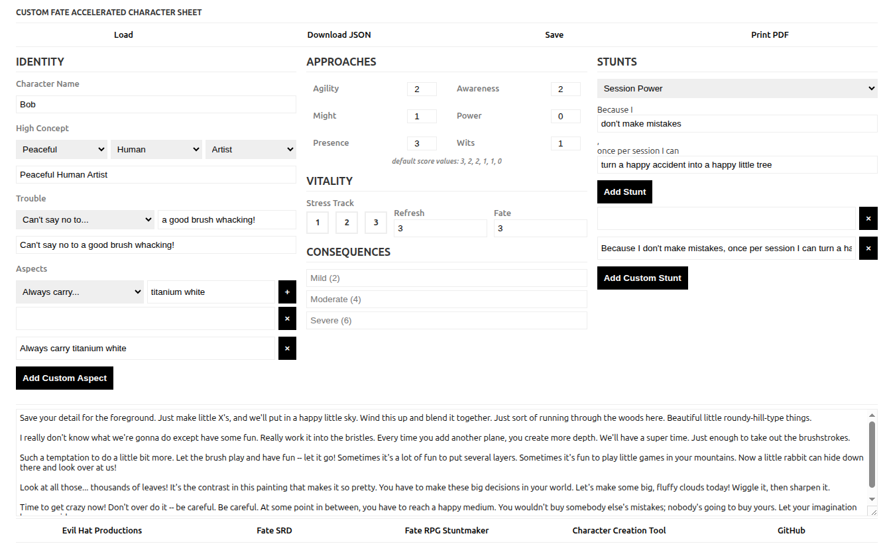
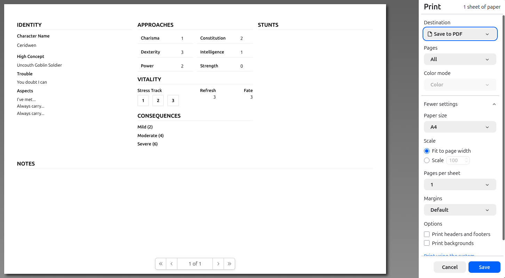

# Brew FAE

## Overview

A vibe-coded (with [Google Gemini](https://gemini.google.com/)) Fate Accelerated (FAE) character creation tool.

> **2026-03-11:**
>
> It didn't take long before the Gemini generated app reached a point where Gemini wasn't effective at maintaining it, and I didn't like the code. To that end, refactoring is in progress.

Long story short, I wanted a custom (fantasy) themed FAE character creation tool I could pass off to players to guide them during character creation. I started whipping something up, quickly decided I would rather be crafting play materials and actually running the game instead of writing tooling and here we are.

## Features

The tool was originally going to be a "skinnable" character creation tool, using the FAE defaults and allowing things like overriding the `Approach` names, and maybe things like the `Stress` box counts, available `Consequences`, etc. There are still shades of that in the source, but they'd need to be dredged up into something more useful.

The feature list, as it evolved, came down to:

- renamed `Approaches`
- fantasy themed, guided character creation for:
    - `High Concept`
    - `Trouble`
    - `Aspects`
    - `Stunts` (allows for both stunt templates, e.g. `+2` and `once per session`)
- freeform entry for guided character creation fields
- saving and loading using `LocalStorage`
- printing (for PDF export)
- JSON data preview and export

## TODO

Things I would like, but aren't dealbreakers at present are:

- **refactor application for ongoing manual maintenance**
- character validation
- random name generation
- true PDF export
- if I were to release this as a bonafide tool for others, some kind of internationalization/localization support

## Screenshots

### Screen UI



### Print Output



## Running locally

Now that files have been split out into `CSS` and `JS` there is `CORS` to consider for local development.

Run a local webserver to serve up a functional version.

I recommend Python (if it's available), but many other quick 'n' dirty serve solutions exist.

```bash
cd /path/to/brewfae/
python -m http.server # you might need to use `python3`

# visit the hosting url in your browser (default is http://0.0.0.0:8000/)
```

## References

These are some helpful references for getting/playing FAE.

* [Fate Accelerated Edition at Evil Hat Producions](https://evilhat.com/product/fate-accelerated-edition/)
* [Fate Accelerated SRD at Fate SRD](https://fate-srd.com/fate-accelerated)
* [Fate RPG Stuntmaker](https://fate-srd.com/stuntmaker/index.html)
* [Sunday-Skypers : FATE Sword & Sorcery (example)](https://sunday-skypers.podbean.com/e/fate-sword-sorcery-two-had-adventure-thrust-upon-them/)
